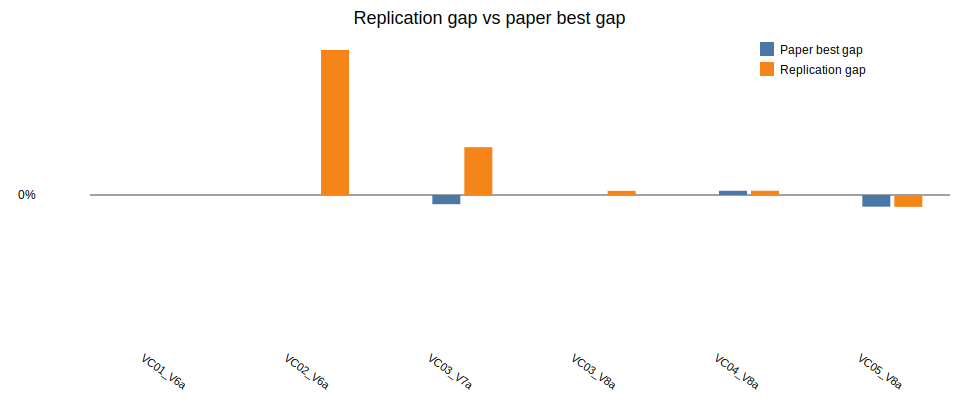

# Beam Search + ILS parallel replication report

Generated: 2026-06-28 20:08

## Batch settings

- Horizon: `120`
- Seeds per instance: `1`
- Total runs: `6`
- Single-thread workers: `6`
- GC between runs: `true`
- Restart workers every N runs: `0` (`0` means disabled)
- Beam nodes per level `N = 1000`
- Maximum children per node `w = 2`
- Greedy randomized completions per successor `q = 3`
- Beam node scorer: `gra`
- ILS iterations: `640`

## Per-instance seed summary

| Instance | Runs | Best ILS | Avg ILS | Best gap | Avg gap | Avg measured time (s) | Avg wall time (s) | Total measured time (s) |
|---|---:|---:|---:|---:|---:|---:|---:|---:|
| LR1_DR02_VC01_V6a | 1 | 33808.96 | 33808.96 | -0.00% | -0.00% | 185.83 | 195.03 | 185.83 |
| LR1_DR02_VC02_V6a | 1 | 78052.08 | 78052.08 | 4.09% | 4.09% | 253.73 | 262.78 | 253.73 |
| LR1_DR02_VC03_V7a | 1 | 40992.20 | 40992.20 | 1.35% | 1.35% | 277.06 | 286.29 | 277.06 |
| LR1_DR02_VC03_V8a | 1 | 43772.61 | 43772.61 | 0.12% | 0.12% | 226.65 | 235.78 | 226.65 |
| LR1_DR02_VC04_V8a | 1 | 41707.14 | 41707.14 | 0.12% | 0.12% | 377.26 | 386.49 | 377.26 |
| LR1_DR02_VC05_V8a | 1 | 36536.36 | 36536.36 | -0.33% | -0.33% | 338.45 | 347.56 | 338.45 |

## Per-run details

The CSV saved beside this report contains one row per instance/seed run with separate `bs_cost`, `ls_cost`, `ils_cost`, `beam_pool`, `ls_improvements`, `beam_seconds`, `ls_seconds`, `ils_seconds`, `total_seconds`, `wall_seconds`, worker pid, worker run count, and worker RSS memory before/after/after-GC columns.

