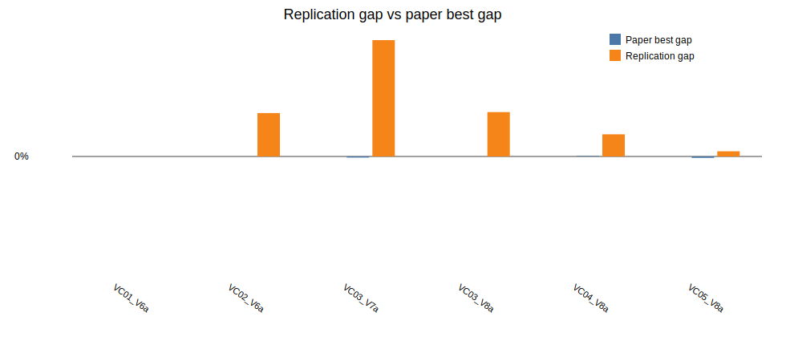

# Beam Search + ILS parallel replication report

Generated: 2026-06-28 20:01

## Batch settings

- Horizon: `120`
- Seeds per instance: `1`
- Total runs: `6`
- Single-thread workers: `2`
- GC between runs: `true`
- Restart workers every N runs: `0` (`0` means disabled)
- Beam nodes per level `N = 5`
- Maximum children per node `w = 2`
- Greedy randomized completions per successor `q = 3`
- Beam node scorer: `gra`
- ILS iterations: `2`

## Per-instance seed summary

| Instance | Runs | Best ILS | Avg ILS | Best gap | Avg gap | Avg measured time (s) | Avg wall time (s) | Total measured time (s) |
|---|---:|---:|---:|---:|---:|---:|---:|---:|
| LR1_DR02_VC01_V6a | 1 | 33808.97 | 33808.97 | -0.00% | -0.00% | 0.86 | 8.28 | 0.86 |
| LR1_DR02_VC02_V6a | 1 | 82552.37 | 82552.37 | 10.10% | 10.10% | 1.03 | 8.42 | 1.03 |
| LR1_DR02_VC03_V7a | 1 | 51389.68 | 51389.68 | 27.06% | 27.06% | 1.02 | 1.02 | 1.02 |
| LR1_DR02_VC03_V8a | 1 | 48232.61 | 48232.61 | 10.32% | 10.32% | 0.79 | 0.79 | 0.79 |
| LR1_DR02_VC04_V8a | 1 | 43803.31 | 43803.31 | 5.15% | 5.15% | 1.63 | 1.63 | 1.63 |
| LR1_DR02_VC05_V8a | 1 | 37101.71 | 37101.71 | 1.21% | 1.21% | 1.30 | 1.30 | 1.30 |

## Per-run details

The CSV saved beside this report contains one row per instance/seed run with separate `bs_cost`, `ls_cost`, `ils_cost`, `beam_pool`, `ls_improvements`, `beam_seconds`, `ls_seconds`, `ils_seconds`, `total_seconds`, `wall_seconds`, worker pid, worker run count, and worker RSS memory before/after/after-GC columns.

