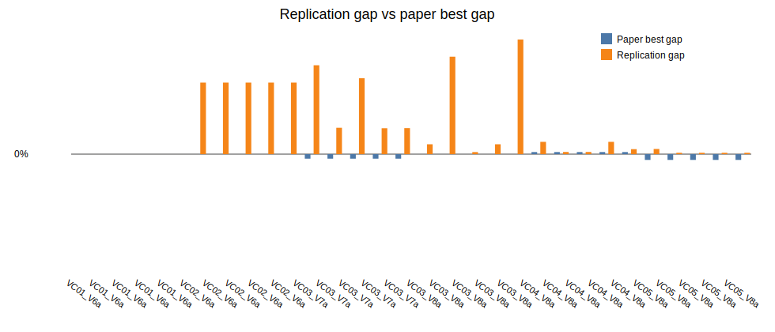

# Beam Search + ILS parallel replication report

Generated: 2026-06-18 14:59

## Batch settings

- Horizon: `120`
- Seeds per instance: `5`
- Total runs: `30`
- Single-thread workers: `2`
- GC between runs: `true`
- Restart workers every N runs: `0` (`0` means disabled)
- Beam nodes per level `N = 1000`
- Maximum children per node `w = 2`
- Greedy randomized completions per successor `q = 3`
- ILS iterations: `640`

## Per-instance seed summary

| Instance | Runs | Best ILS | Avg ILS | Best gap | Avg gap | Avg measured time (s) | Avg wall time (s) | Total measured time (s) |
|---|---:|---:|---:|---:|---:|---:|---:|---:|
| LR1_DR02_VC01_V6a | 5 | 33808.95 | 33808.95 | -0.00% | -0.00% | 284.66 | 287.26 | 1423.31 |
| LR1_DR02_VC02_V6a | 5 | 78052.08 | 78052.08 | 4.09% | 4.09% | 384.25 | 384.25 | 1921.23 |
| LR1_DR02_VC03_V7a | 5 | 41044.96 | 41571.01 | 1.48% | 2.78% | 433.88 | 433.88 | 2169.41 |
| LR1_DR02_VC03_V8a | 5 | 43772.63 | 44891.22 | 0.12% | 2.68% | 293.09 | 293.09 | 1465.45 |
| LR1_DR02_VC04_V8a | 5 | 41708.64 | 41818.62 | 0.12% | 0.39% | 336.69 | 336.69 | 1683.46 |
| LR1_DR02_VC05_V8a | 5 | 36687.48 | 36703.50 | 0.08% | 0.12% | 251.34 | 251.34 | 1256.71 |

## Per-run diagnostics

The CSV saved beside this report contains one row per instance/seed run with separate `bs_cost`, `ls_cost`, `ils_cost`, `beam_seconds`, `ls_seconds`, `ils_seconds`, `total_seconds`, `wall_seconds`, worker pid, worker run count, and worker RSS memory before/after/after-GC columns.

