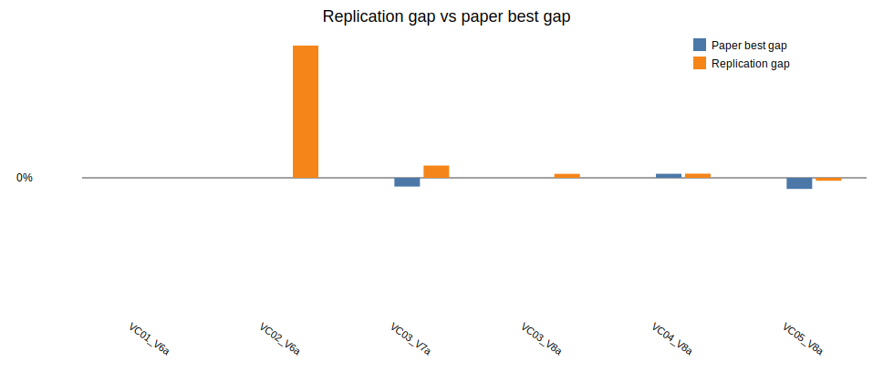

# Beam Search + ILS parallel replication report

Generated: 2026-06-28 20:12

## Batch settings

- Horizon: `120`
- Seeds per instance: `1`
- Total runs: `6`
- Single-thread workers: `6`
- GC between runs: `true`
- Restart workers every N runs: `0` (`0` means disabled)
- Beam nodes per level `N = 1000`
- Maximum children per node `w = 2`
- Greedy randomized completions per successor `q = 3`
- Beam node scorer: `predictive`
- Predictive surrogate model: `linear`
- Predictive warmup levels: `1`
- Predictive minimum samples: `16`
- Predictive ridge lambda: `1.0`
- Predictive shortlist multiplier: `2`
- ILS iterations: `640`

## Per-instance seed summary

| Instance | Runs | Best ILS | Avg ILS | Best gap | Avg gap | Avg measured time (s) | Avg wall time (s) | Total measured time (s) |
|---|---:|---:|---:|---:|---:|---:|---:|---:|
| LR1_DR02_VC01_V6a | 1 | 33808.95 | 33808.95 | -0.00% | -0.00% | 123.50 | 132.72 | 123.50 |
| LR1_DR02_VC02_V6a | 1 | 77928.08 | 77928.08 | 3.93% | 3.93% | 159.73 | 168.86 | 159.73 |
| LR1_DR02_VC03_V7a | 1 | 40593.57 | 40593.57 | 0.36% | 0.36% | 169.02 | 178.28 | 169.02 |
| LR1_DR02_VC03_V8a | 1 | 43772.61 | 43772.61 | 0.12% | 0.12% | 133.04 | 142.20 | 133.04 |
| LR1_DR02_VC04_V8a | 1 | 41708.63 | 41708.63 | 0.12% | 0.12% | 217.34 | 226.41 | 217.34 |
| LR1_DR02_VC05_V8a | 1 | 36627.22 | 36627.22 | -0.09% | -0.09% | 190.44 | 199.57 | 190.44 |

## Per-run details

The CSV saved beside this report contains one row per instance/seed run with separate `bs_cost`, `ls_cost`, `ils_cost`, `beam_pool`, `ls_improvements`, `beam_seconds`, `ls_seconds`, `ils_seconds`, `total_seconds`, `wall_seconds`, worker pid, worker run count, and worker RSS memory before/after/after-GC columns.

