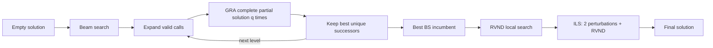
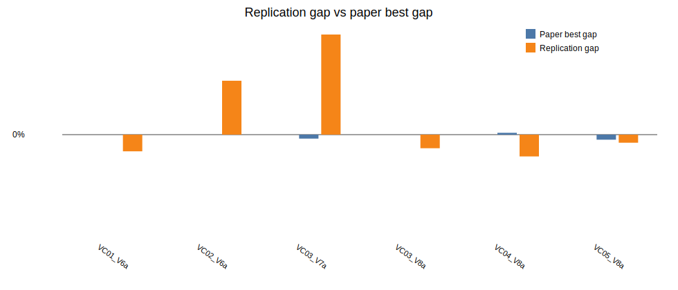

# Beam Search + ILS replication report

Generated: 2026-06-02 01:26

## Scope

The paper was read page by page from rendered page images in `.codex/paper_pages/page-01.png` through `page-26.png`. The implementation follows the paper's BS-GRA-ILS structure for the six requested MIRPLib Group 2 instances with horizon 120, using one seed.

The paper also reports 180- and 360-period variants and averages over ten seeds. Those were not run here because the user listed instance names but did not specify horizons; horizon 120 is the first summary table in the paper and is the least ambiguous baseline for these six instances.

## Paper parameters used

| Component | Parameter | Value | Paper location |
|---|---:|---:|---|
| Beam search | Nodes per level `N` | 1000 | Results tables for these six 120-period instances |
| Beam search | Max children per node `w` | 2 | Table 3 / Section 5.2.1 |
| GRA | Greedy completions `q` | 3 | Section 5.2.2 |
| GRA | Randomness | Port only | Appendix B, Table B.13 |
| GRA | Aggregation | Median | Appendix B, Table B.14 |
| ILS | SA initial probability | 0.79 | Table 4 |
| ILS | SA final probability | 0.01 | Table 4 |
| ILS | Iterations | 640 | Table 4 |
| ILS | Restore after non-improving moves | 4 | Table 4 |
| ILS | Perturbations per iteration | 2 | Table 4 |

## Algorithm sketch

## Results

The objective column is the MIRPLib upper-bound/objective value used in the paper table. "Paper best" is Table 5's BS-ILS best cost. The replication gap is computed against the objective value, matching the paper's convention.

| Instance | Obj | Paper best | Rep BS | Rep LS | Rep ILS | Rep gap | Time (s) |
|---|---:|---:|---:|---:|---:|---:|---:|
| LR1_DR02_VC01_V6a | 33,809.00 | 33,808.95 | 33,440.17 | 33,440.17 | 33,440.17 | -1.09% | 612.66 |
| LR1_DR02_VC02_V6a | 74,982.00 | 74,981.65 | 77,626.47 | 77,626.47 | 77,626.47 | 3.53% | 1,296.73 |
| LR1_DR02_VC03_V7a | 40,446.00 | 40,340.01 | 43,095.86 | 43,095.86 | 43,095.86 | 6.55% | 1,389.53 |
| LR1_DR02_VC03_V8a | 43,721.00 | 43,721.43 | 43,332.15 | 43,332.15 | 43,332.15 | -0.89% | 929.97 |
| LR1_DR02_VC04_V8a | 41,657.00 | 41,708.65 | 41,304.29 | 41,304.29 | 41,062.98 | -1.43% | 2,740.89 |
| LR1_DR02_VC05_V8a | 36,659.00 | 36,536.62 | 36,465.26 | 36,465.26 | 36,465.26 | -0.53% | 2,144.89 |
| Average | 45,212.33 | 45,183.89 | 45,877.38 | 45,877.38 | 45,837.82 | 1.02% | 1,519.11 |

## What matches

- The solution representation is a vector of `(port, vessel)` calls with last/next occurrence pointers for ports and vessels.
- Beam search expands partial routes and uses GRA completions to score successors.
- The GRA deterministic version selects the port closest to inventory violation and the earliest feasible vessel.
- The stochastic GRA variant randomizes port selection only, matching the best appendix setting.
- The ILS uses the Table 4 parameter values without hyperparameter tuning.
- The six requested instances were run with the paper `N = 1000`, `w = 2`, `q = 3` settings.

## Deviations and justification

- The paper does not fully specify all tie breaks, simulated annealing temperature conversion, or local-search pruning rules. The SA schedule here interpolates exponentially between the reported initial and final acceptance probabilities.
- The implementation applies RVND to the BS incumbent before ILS. The paper's figure/text suggests LS is applied broadly to generated solutions; doing that exactly would require additional pruning details to keep runtime comparable.
- The evaluator models inventory balance at a service period as `previous inventory + production/consumption effect -/+ vessel quantity`, matching the paper's period balance. This fixed the artificial over-capacity penalties that appeared when production was advanced before same-period loading.
- The evaluator still simplifies the complete arc-flow cost accounting, especially source/sink/end-of-route arcs and exact early-finish reward handling. Therefore costs below the published objective should be interpreted as replication-model differences, not new best-known solutions.
- Only one seed was run. The paper's best and average columns are based on ten seeds, so stochastic comparisons are indicative rather than statistically equivalent.

## Artifacts

- Raw CSV: `results/bs_ils_replication_paper_120_20260601_225418.csv`
- Gap chart: `results/bs_ils_replication_gap_paper_120_20260601_225418.svg`
- Runner log: `results/paper_runner_stdout.log`
