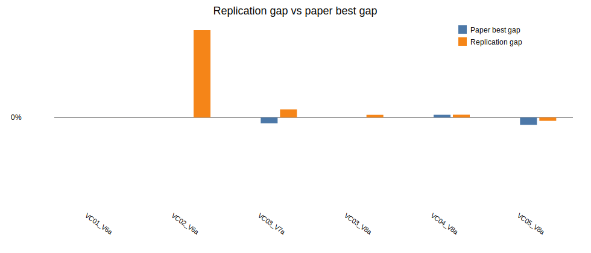

# Beam Search + ILS replication report

Generated: 2026-06-28 11:33

## Paper settings used

- Beam nodes per level `N = 1000`
- Maximum children per node `w = 2`
- Greedy randomized completions per successor `q = 3`
- Beam node scorer: `predictive`
- Predictive surrogate model: `linear`
- Predictive warmup levels: `1`
- Predictive minimum samples: `16`
- Predictive ridge lambda: `1.0`
- Predictive shortlist multiplier: `2`
- ILS parameters from Table 4: initial SA probability `0.79`, final SA probability `0.01`, `640` iterations, restore after `4` non-improving accepted moves, `2` perturbations
- Horizon run in this batch: `120`

## Implementation notes

This variant replaces exhaustive GRA-based beam-node scoring with an online `linear` predictive model. The model is trained from GRA-completed partial nodes, ranks all successors cheaply, and only the top predictive shortlist is GRA-completed before choosing children and saving incumbent candidates for RVND and ILS.

## Results

| Instance | Obj | Paper best | Rep BS | Rep LS | Rep ILS | Rep gap | Time (s) |
|---|---:|---:|---:|---:|---:|---:|---:|
| LR1_DR02_VC01_V6a | 33809.00 | 33808.95 | 33808.97 | 33808.95 | 33808.95 | -0.00% | 79.00 |
| LR1_DR02_VC02_V6a | 74982.00 | 74981.65 | 77928.08 | 77928.08 | 77928.08 | 3.93% | 106.54 |
| LR1_DR02_VC03_V7a | 40446.00 | 40340.01 | 40954.04 | 40593.57 | 40593.57 | 0.36% | 118.21 |
| LR1_DR02_VC03_V8a | 43721.00 | 43721.43 | 43772.61 | 43772.61 | 43772.61 | 0.12% | 90.04 |
| LR1_DR02_VC04_V8a | 41657.00 | 41708.65 | 41950.06 | 41708.69 | 41708.66 | 0.12% | 175.15 |
| LR1_DR02_VC05_V8a | 36659.00 | 36536.62 | 36627.23 | 36603.23 | 36603.23 | -0.15% | 142.80 |

