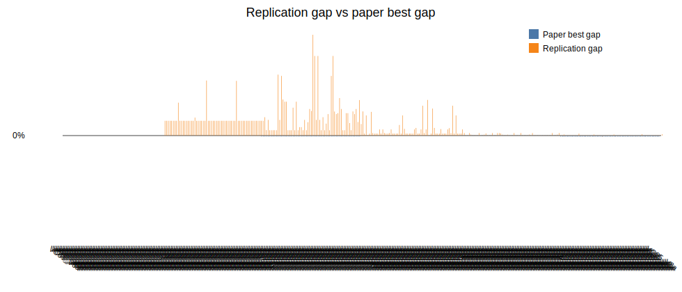

# Beam Search + ILS parallel replication report

Generated: 2026-06-18 08:38

## Batch settings

- Horizon: `120`
- Seeds per instance: `60`
- Total runs: `360`
- Single-thread workers: `10`
- Beam nodes per level `N = 1000`
- Maximum children per node `w = 2`
- Greedy randomized completions per successor `q = 3`
- ILS iterations: `640`

## Per-instance seed summary

| Instance | Runs | Best ILS | Avg ILS | Best gap | Avg gap | Avg run time (s) | Total run time (s) |
|---|---:|---:|---:|---:|---:|---:|---:|
| LR1_DR02_VC01_V6a | 60 | 33808.95 | 33808.95 | -0.00% | -0.00% | 548.52 | 32911.38 |
| LR1_DR02_VC02_V6a | 60 | 78052.08 | 78403.14 | 4.09% | 4.56% | 795.59 | 47735.42 |
| LR1_DR02_VC03_V7a | 60 | 41044.96 | 42991.59 | 1.48% | 6.29% | 871.57 | 52293.97 |
| LR1_DR02_VC03_V8a | 60 | 43772.62 | 44486.25 | 0.12% | 1.75% | 656.73 | 39403.78 |
| LR1_DR02_VC04_V8a | 60 | 41707.07 | 41765.50 | 0.12% | 0.26% | 1498.53 | 89911.58 |
| LR1_DR02_VC05_V8a | 60 | 36536.62 | 36688.48 | -0.33% | 0.08% | 1164.74 | 69884.24 |

## Per-run results

The CSV saved beside this report contains one row per instance/seed run with separate `bs_cost`, `ls_cost`, `ils_cost`, `beam_seconds`, `ls_seconds`, `ils_seconds`, and `total_seconds` columns.

