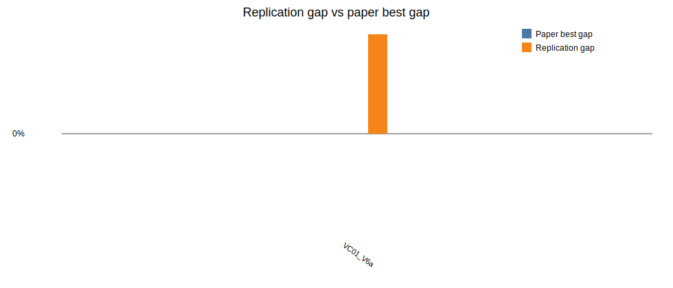

# Beam Search + ILS replication report

Generated: 2026-06-24 14:32

## Paper settings used

- Beam nodes per level `N = 5`
- Maximum children per node `w = 1`
- Greedy randomized completions per successor `q = 1`
- Beam node scorer: `predictive`
- Predictive surrogate model: `linear`
- Predictive warmup levels: `1`
- Predictive minimum samples: `4`
- Predictive ridge lambda: `1.0`
- Predictive shortlist multiplier: `2`
- ILS parameters from Table 4: initial SA probability `0.79`, final SA probability `0.01`, `1` iterations, restore after `4` non-improving accepted moves, `2` perturbations
- Horizon run in this batch: `120`

## Implementation notes

This variant replaces exhaustive GRA-based beam-node scoring with an online `linear` predictive model. The model is trained from GRA-completed partial nodes, ranks all successors cheaply, and only the top predictive shortlist is GRA-completed before choosing children and saving incumbent candidates for RVND and ILS.

## Results

| Instance | Obj | Paper best | Rep BS | Rep LS | Rep ILS | Rep gap | Time (s) |
|---|---:|---:|---:|---:|---:|---:|---:|
| LR1_DR02_VC01_V6a | 33809.00 | 33808.95 | 46188.18 | 37785.51 | 37785.51 | 11.76% | 0.45 |

