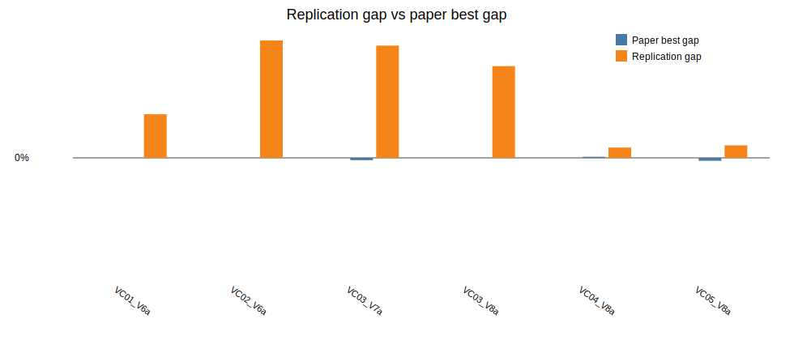

# Beam Search + ILS parallel replication report

Generated: 2026-06-28 11:11

## Batch settings

- Horizon: `120`
- Seeds per instance: `1`
- Total runs: `6`
- Single-thread workers: `2`
- GC between runs: `true`
- Restart workers every N runs: `0` (`0` means disabled)
- Beam nodes per level `N = 5`
- Maximum children per node `w = 2`
- Greedy randomized completions per successor `q = 3`
- Beam node scorer: `predictive`
- Predictive surrogate model: `linear`
- Predictive warmup levels: `1`
- Predictive minimum samples: `16`
- Predictive ridge lambda: `1.0`
- Predictive shortlist multiplier: `2`
- ILS iterations: `2`

## Per-instance seed summary

| Instance | Runs | Best ILS | Avg ILS | Best gap | Avg gap | Avg measured time (s) | Avg wall time (s) | Total measured time (s) |
|---|---:|---:|---:|---:|---:|---:|---:|---:|
| LR1_DR02_VC01_V6a | 1 | 35468.23 | 35468.23 | 4.91% | 4.91% | 0.62 | 8.03 | 0.62 |
| LR1_DR02_VC02_V6a | 1 | 84882.34 | 84882.34 | 13.20% | 13.20% | 0.71 | 8.02 | 0.71 |
| LR1_DR02_VC03_V7a | 1 | 45553.41 | 45553.41 | 12.63% | 12.63% | 0.58 | 0.58 | 0.58 |
| LR1_DR02_VC03_V8a | 1 | 48232.55 | 48232.55 | 10.32% | 10.32% | 0.46 | 0.46 | 0.46 |
| LR1_DR02_VC04_V8a | 1 | 42143.14 | 42143.14 | 1.17% | 1.17% | 0.91 | 0.91 | 0.91 |
| LR1_DR02_VC05_V8a | 1 | 37174.81 | 37174.81 | 1.41% | 1.41% | 0.67 | 0.67 | 0.67 |

## Per-run details

The CSV saved beside this report contains one row per instance/seed run with separate `bs_cost`, `ls_cost`, `ils_cost`, `beam_pool`, `ls_improvements`, `beam_seconds`, `ls_seconds`, `ils_seconds`, `total_seconds`, `wall_seconds`, worker pid, worker run count, and worker RSS memory before/after/after-GC columns.

