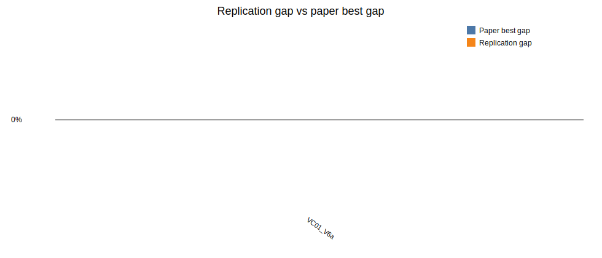

# Beam Search + ILS replication report

Generated: 2026-06-23 21:25

## Paper settings used

- Beam nodes per level `N = 5`
- Maximum children per node `w = 1`
- Greedy randomized completions per successor `q = 1`
- Beam node scorer: `gra`
- ILS parameters from Table 4: initial SA probability `0.79`, final SA probability `0.01`, `1` iterations, restore after `4` non-improving accepted moves, `2` perturbations
- Horizon run in this batch: `120`

## Implementation notes

The paper does not specify every tie-break, random sampling, and simulated annealing temperature detail. This replication follows the described structure: BS evaluates partial solutions with one deterministic and `q - 1` randomized greedy completions, keeps the best `N` complete GRA solutions found across the beam, applies RVND to that saved pool, then passes the best locally improved solution to ILS.

## Results

| Instance | Obj | Paper best | Rep BS | Rep LS | Rep ILS | Rep gap | Time (s) |
|---|---:|---:|---:|---:|---:|---:|---:|
| LR1_DR02_VC01_V6a | 33809.00 | 33808.95 | 33808.99 | 33808.99 | 33808.99 | -0.00% | 0.42 |

