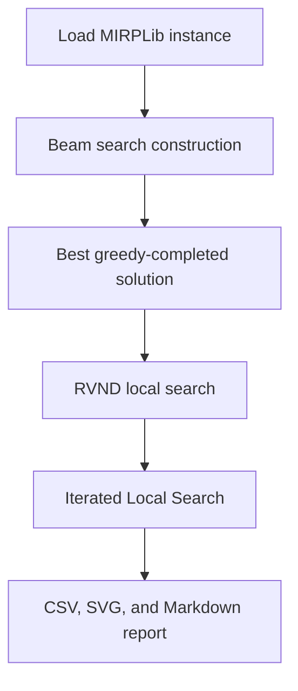

# Beam Search - Iterated Local Search Algorithm Walkthrough

This document explains the replication implementation step by step. The paper calls the improvement phase ILS, meaning Iterated Local Search. The request used "iterative line search"; in this codebase that corresponds to the `iterated_local_search` phase.

## Code map

| Area | Main file | Main functions and types |
|---|---|---|
| Solution representation | `solution_var.jl` | `Call`, `Solution`, `clone_solution`, `append_call`, `solution_signature` |
| Schedule evaluation and greedy completion | `greedy_randomize_algorithm.jl` | `evaluate_solution!`, `append_evaluated_call`, `advance_inventory`, `first_service_time`, `greedy_complete_solution`, `deterministic_eval`, `stochastic_eval` |
| Beam search construction | `beam_search.jl` | `beam_search`, `expand_node`, `evaluate`, `possible_calls`, `keep_best_N_unique` |
| Local search neighborhoods | `neighbourhood.jl` | `swap_candidates`, `relocate_candidates`, `replace_candidates`, `insert_candidates`, `remove_candidates`, `swap_port_candidates`, `apply_perturbation` |
| RVND local search | `local_search.jl` | `local_search` |
| Iterated Local Search | `iterated_local_search.jl` | `ILSParameters`, `annealing_probability`, `sim_annealing_criterion`, `iterated_local_search` |
| Replication runs and reports | `replication_runner.jl` | `run_instance`, `write_results_csv`, `write_gap_svg`, `write_report`, `main` |

## End-to-end flow



The executable replication path is:

1. `replication_runner.jl` loads a target MIRPLib instance with `loadMIRP(instance, horizon)`.
2. `beam_search` builds a high-quality feasible route sequence.
3. `local_search` applies randomized variable neighborhood descent to the beam incumbent.
4. `iterated_local_search` repeatedly perturbs and locally improves the solution.
5. The runner writes the result table, gap figure, and Markdown report.

## 1. Solution representation

The implementation models a candidate solution as an ordered sequence of calls.

`Call` in `solution_var.jl` represents one vessel visiting one port. It stores:

- `port` and `vessel`, the actual routing decision.
- Previous and next occurrence links by vessel and by port.
- The scheduled service time.
- The number of vessels already using the port berth at that time.
- The inventory level after service.
- Cumulative routing, inventory, and total costs up to that call.

`Solution` stores the vector of `Call` objects plus cached evaluator state:

- `last_occ_ports` and `last_occ_vessels` point to the latest call involving each port or vessel.
- `vessel_inventory` and `port_inventory` store the state after the evaluated prefix.
- `vessel_time` and `port_time` store the latest service/inventory update period.
- `port_next_violation` stores the next period where each port will violate inventory if no service is added.
- `score` stores the objective value.
- `feasible` marks whether the evaluated sequence can be scheduled within the horizon.

The helper `append_call(mirp, solution, port, vessel)` does not mutate the original solution. It copies the call sequence, appends one decision, and returns a new unevaluated `Solution`. Beam construction and GRA use `append_evaluated_call`, which copies the already-evaluated prefix state and evaluates only the newly appended call.

## 2. Schedule evaluation

All construction and improvement phases depend on the evaluator logic in `greedy_randomize_algorithm.jl`. `evaluate_solution!` is the full rebuild path used for validation and neighborhood moves. `append_evaluated_call` is the incremental path used by beam search and the GRA when the parent prefix has already been evaluated.

For each call in sequence, the evaluator performs these steps:

1. Reset cached state with `reset_solution_state!`.
2. Check whether the selected vessel can serve the selected port with `is_feasible`.
3. Determine the vessel's previous port and previous service time.
4. Compute the earliest arrival using travel time.
5. Find the first valid service period with `first_service_time`.
6. Advance port inventory to the period before service using `advance_inventory`.
7. Add routing cost with `route_cost`.
8. Apply loading or unloading through `apply_service!`.
9. Store predecessor/successor links and cumulative costs in the `Call`.
10. Update the solution's latest vessel, port, time, and inventory caches.

At the end, if `add_final_inventory_cost = true`, all ports are advanced to the horizon and any final inventory violations are charged.

For beam/GRA appends, `append_evaluated_call` performs the same operations only for the new call. It reuses the parent's cached latest port/vessel occurrences, inventory levels, service times, next violation times, and cumulative costs. Final inventory cost is added inline once the greedy completion stops.

### Inventory handling

`advance_inventory` evolves a port from `from_t + 1` through `to_t`.

- Loading ports produce inventory and can exceed capacity.
- Unloading ports consume inventory and can fall below zero.
- Violations are charged using `violation_price`, which falls back to `mirp.metadata.spot_market_price` when the period price is zero.

At a service period, the evaluator first advances inventory only to `service_time - 1`. Then `apply_service!` applies the service-period rate and the load/unload operation together. This avoids charging the service period twice and keeps the operation aligned with the paper's period-based inventory logic.

### Feasibility

`is_feasible` is route compatibility, not a full schedule-feasibility test. It follows the paper rule that vessels travel full from loading to discharging ports and empty from discharging to loading ports. Cargo is therefore a derived state used for load/unload quantities and route-cost discounts, not a separate append filter.

`first_service_time` searches from vessel arrival to the horizon. A period is acceptable only if:

- The port berth limit is not exceeded.
- `service_is_inventory_feasible` says the service-period inventory balance can stay within bounds after loading or unloading.

If no period is found for an appended call, that branch is discarded and the caller keeps the parent prefix. The whole search state only becomes "infeasible" when the code is evaluating that specific candidate solution object.

## 3. Greedy randomized completion

Beam search evaluates partial nodes by completing them into full schedules. That logic is in `greedy_complete_solution`.

The completion loop is:

1. Clone the already-evaluated partial solution, or rebuild it once if needed.
2. Read the cached `port_next_violation` values inline and find ports that would violate inventory before the horizon.
3. Select the next port inline, either deterministically by earliest violation or stochastically with higher weight for earlier violations.
4. Build feasible vessel options inline by trying `append_evaluated_call` for route-compatible vessels.
5. Append the call with `append_evaluated_call`, evaluating only the new service.
6. If the selected port has no schedulable vessel, skip that port for the current prefix and try another urgent port.
7. If an appended call cannot be scheduled, discard only that extension, keep the current prefix, and try another urgent port.
8. Repeat until no port needs service or all urgent ports fail for the current prefix.
9. Add final inventory cost inline and return the completed solution.

The deterministic version uses the earliest inventory violation and earliest feasible vessel:

- `deterministic_eval(node, mirp)`

The randomized version samples from urgency-weighted candidates:

- `stochastic_eval(node, mirp; randomize_port = true, randomize_vessel = false)`

Weights come from `early_time_weights`, which gives higher probability to earlier violation or service times.

## 4. Beam search

Beam search is implemented in `beam_search.jl`.

The paper parameters used by the replication runner are:

- `N = 1000`, the maximum number of retained beam nodes per level.
- `w = 2`, the maximum number of successors retained per expanded node.
- `q = 3`, the number of greedy completions used to evaluate each successor.

The beam loop starts from an empty solution:

```julia
initial_node = evaluate_solution!(mirp, Solution(mirp); add_final_inventory_cost = false)
beam_nodes = [initial_node]
```

For each level:

1. For every current beam node, call `expand_node`.
2. `possible_calls` generates every port-vessel pair that passes the immediate route-compatibility rule.
3. `create_new_node` appends one call with `append_evaluated_call`, reusing the parent prefix state.
4. `evaluate(successor, mirp, q)` completes the successor once deterministically and `q - 1` times stochastically.
5. The successor's beam score becomes the median score of its feasible completions.
6. `expand_node` keeps the best `w` unique successors for that parent.
7. The global beam is replaced with the best `N` unique successors across all parents.
8. Completed greedy solutions are retained as incumbent candidates.

Uniqueness is handled by `keep_best_N_unique`, which sorts by score and keeps one solution per rounded score key. This matches the paper's statement that unique scored nodes are retained while avoiding floating point noise.

The final beam result is the best solution among all retained greedy completions and a fallback empty-schedule evaluation.

## 5. RVND local search

The local search is `local_search` in `local_search.jl`. It is a Randomized Variable Neighborhood Descent with first improvement.

The neighborhood set is defined in `neighbourhood.jl`:

| Neighborhood | Function | Meaning |
|---|---|---|
| `:swap` | `swap_candidates` | Swap the positions of two calls. |
| `:relocate` | `relocate_candidates` | Move one call to another position. |
| `:replace` | `replace_candidates` | Replace a call's port with another port of the same type. |
| `:insert` | `insert_candidates` | Add a short feasible loading/unloading cycle for one vessel. |
| `:remove` | `remove_candidates` | Remove a call and sometimes the next call of the same vessel. |
| `:swap_port` | `swap_port_candidates` | Swap compatible ports between two calls while keeping vessels fixed. |

The RVND loop is:

1. Evaluate the initial solution.
2. Shuffle the neighborhood order.
3. Generate candidates for the current neighborhood.
4. Shuffle the candidates.
5. Accept the first candidate with strictly lower score.
6. Restart from a new shuffled neighborhood order.
7. Stop only after a complete pass finds no improvement.

Every neighbor is passed through `evaluate_solution!`, so local search never accepts an infeasible or unevaluated sequence.

## 6. Iterated Local Search

The ILS implementation is in `iterated_local_search.jl`.

`ILSParameters` stores the tuned parameters from the paper's Table 4:

- Initial simulated annealing acceptance probability: `0.79`
- Final simulated annealing acceptance probability: `0.01`
- Iterations: `640`
- Restore after accepted non-improving moves: `4`
- Perturbations per iteration: `2`

The ILS flow is:

1. Start from the local optimum returned by `local_search`.
2. Keep both `current_solution` and `best_solution`.
3. For each iteration, apply `params.perturbations` random perturbations.
4. Each perturbation uses `apply_perturbation`, which shuffles neighborhoods and samples a feasible candidate from the first neighborhood that can produce one.
5. Improve the perturbed solution with `local_search`.
6. Accept the improved solution if it is better than the current solution.
7. Otherwise, accept it with `sim_annealing_criterion`.
8. If the accepted solution improves the best incumbent, update `best_solution`.
9. If too many accepted moves fail to improve the best solution, restore `current_solution` to `best_solution`.
10. Return `best_solution`.

The simulated annealing probability is computed by `annealing_probability`. The paper reports an initial and final probability but not a full temperature formula, so the replication uses exponential interpolation between those probabilities across the 640 iterations.

## 7. Replication runner

`replication_runner.jl` connects the algorithm to the requested paper-style experiment.

The main settings are:

```julia
const PAPER_BS_N = 1000
const PAPER_BS_W = 2
const PAPER_GRA_Q = 3
const PAPER_ILS_PARAMETERS = ILSParameters()
```

`run_instance` performs the sequence:

```julia
beam_result = beam_search(mirp; N = N, w = w, q = q, rng = rng)
ls_solution = local_search(mirp, beam_result.best_solution; rng = rng)
ils_solution = iterated_local_search(mirp, ls_solution; rng = rng, params = ils_params)
```

The runner records:

- Beam search cost.
- RVND local search cost.
- Final ILS cost.
- Gap against the MIRPLib upper bound, or against the paper objective if no finite upper bound is available.
- Number of calls and elapsed time by phase.

It writes:

- A CSV table with raw numeric results.
- An SVG gap comparison figure.
- A Markdown report in the same style as the paper table.

## 8. Commands

Run the small default smoke case:

```powershell
julia --startup-file=no main.jl
```

Run a quick replication smoke batch:

```powershell
julia --startup-file=no replication_runner.jl --horizon=120 --N=5 --ils-iterations=2 --label=smoke
```

Run the paper-parameter batch used for the six requested instances:

```powershell
julia --startup-file=no replication_runner.jl --horizon=120 --seeds=1 --label=paper
```

## 9. Known replication choices and limitations

The paper leaves several implementation details unspecified. The current code follows the algorithmic structure as closely as possible, with these documented choices:

- Beam node scoring uses the median of feasible deterministic and randomized greedy completions, matching the paper's `q`-completion idea.
- Random greedy completion randomizes urgent port choice, while vessel choice remains earliest feasible by default. This keeps the construction stable and close to the deterministic rule.
- The paper does not specify a full simulated annealing temperature schedule, so `annealing_probability` interpolates between the reported initial and final probabilities.
- RVND is applied to the beam incumbent before ILS. Applying RVND to every completed beam candidate was not added because the paper's pruning and runtime details are not fully specified.
- Neighborhoods are implemented as sequence edits over calls, then rechecked by the evaluator. This keeps feasibility centralized in `evaluate_solution!`.

The most important implementation contract is that any generated sequence must pass through the same evaluator semantics before its score is trusted. Beam search and GRA use the incremental `append_evaluated_call` path for appends; RVND and ILS still use full `evaluate_solution!` rebuilds for arbitrary sequence edits. Both paths keep routing costs, inventory costs, berth feasibility, and horizon feasibility consistent.
