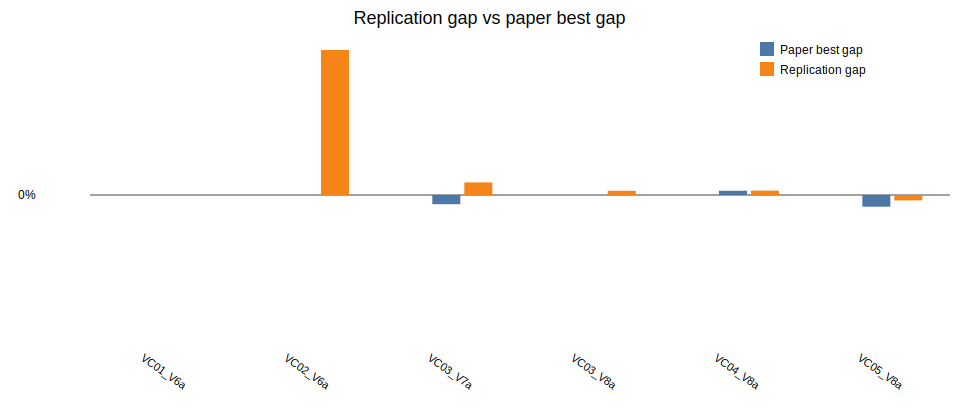

# Beam Search + ILS parallel replication report

Generated: 2026-06-23 10:23

## Batch settings

- Horizon: `120`
- Seeds per instance: `1`
- Total runs: `6`
- Single-thread workers: `6`
- GC between runs: `true`
- Restart workers every N runs: `0` (`0` means disabled)
- Beam nodes per level `N = 1000`
- Maximum children per node `w = 2`
- Greedy randomized completions per successor `q = 3`
- ILS iterations: `640`

## Per-instance seed summary

| Instance | Runs | Best ILS | Avg ILS | Best gap | Avg gap | Avg measured time (s) | Avg wall time (s) | Total measured time (s) |
|---|---:|---:|---:|---:|---:|---:|---:|---:|
| LR1_DR02_VC01_V6a | 1 | 33808.95 | 33808.95 | -0.00% | -0.00% | 2077.51 | 2122.83 | 2077.51 |
| LR1_DR02_VC02_V6a | 1 | 78052.08 | 78052.08 | 4.09% | 4.09% | 2392.70 | 2440.05 | 2392.70 |
| LR1_DR02_VC03_V7a | 1 | 40589.73 | 40589.73 | 0.36% | 0.36% | 2550.37 | 2587.44 | 2550.37 |
| LR1_DR02_VC03_V8a | 1 | 43772.61 | 43772.61 | 0.12% | 0.12% | 2026.56 | 2075.13 | 2026.56 |
| LR1_DR02_VC04_V8a | 1 | 41708.66 | 41708.66 | 0.12% | 0.12% | 2940.93 | 2983.63 | 2940.93 |
| LR1_DR02_VC05_V8a | 1 | 36603.23 | 36603.23 | -0.15% | -0.15% | 2794.65 | 2842.53 | 2794.65 |

## Per-run diagnostics

The CSV saved beside this report contains one row per instance/seed run with separate `bs_cost`, `ls_cost`, `ils_cost`, `beam_pool`, `ls_improvements`, `beam_seconds`, `ls_seconds`, `ils_seconds`, `total_seconds`, `wall_seconds`, worker pid, worker run count, and worker RSS memory before/after/after-GC columns.

