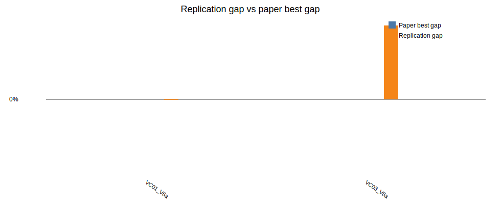

# Beam Search + ILS replication report

Generated: 2026-06-16 20:45

## Paper settings used

- Beam nodes per level `N = 1000`
- Maximum children per node `w = 2`
- Greedy randomized completions per successor `q = 3`
- ILS parameters from Table 4: initial SA probability `0.79`, final SA probability `0.01`, `640` iterations, restore after `4` non-improving accepted moves, `2` perturbations
- Horizon run in this batch: `120`

## Implementation notes

The paper does not specify every tie-break, random sampling, and simulated annealing temperature detail. This replication follows the described structure: BS evaluates partial solutions with one deterministic and `q - 1` randomized greedy completions, keeps unique scored nodes, applies RVND neighborhoods, then runs ILS. The local-search phase is applied to the BS incumbent before ILS; applying RVND to every generated complete solution was left as a documented deviation because the paper's implementation details and pruning rules are not fully specified.

## Results

| Instance | Obj | Paper best | Rep BS | Rep LS | Rep ILS | Rep gap | Time (s) |
|---|---:|---:|---:|---:|---:|---:|---:|
| LR1_DR02_VC01_V6a | 33809.00 | 33808.95 | 33440.17 | 33440.17 | 33440.17 | -1.09% | 893.25 |
| LR1_DR02_VC03_V8a | 43721.00 | 43721.43 | 109026.91 | 109026.91 | 109026.91 | 149.37% | 1261.73 |

