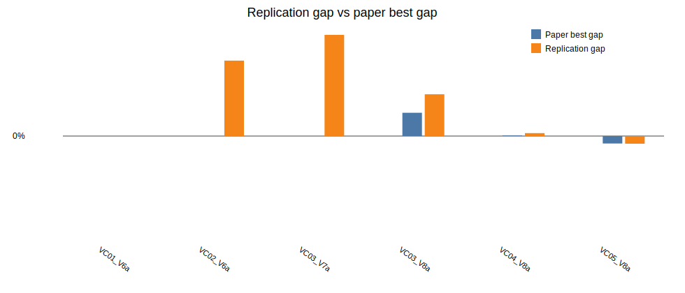

# Beam Search + ILS replication report

Generated: 2026-07-01 09:44

## Paper settings used

- Beam nodes per level `N = 1000`
- Maximum children per node `w = 2`
- Greedy randomized completions per successor `q = 3`
- Beam node scorer: `gra`
- ILS parameters from Table 4: initial SA probability `0.79`, final SA probability `0.01`, `640` iterations, restore after `4` non-improving accepted moves, `2` perturbations
- Horizon run in this batch: `180`

## Implementation notes

The paper does not specify every tie-break, random sampling, and simulated annealing temperature detail. This replication follows the described structure: BS evaluates partial solutions with one deterministic and `q - 1` randomized greedy completions, keeps the best `N` complete GRA solutions found across the beam, applies RVND to that saved pool, then passes the best locally improved solution to ILS.

## Results

| Instance | Obj | Paper best | Rep BS | Rep LS | Rep ILS | Rep gap | Time (s) |
|---|---:|---:|---:|---:|---:|---:|---:|
| LR1_DR02_VC01_V6a | 52167.00 | 52167.21 | 65395.13 | 52167.22 | 52167.22 | 0.00% | 306.57 |
| LR1_DR02_VC02_V6a | 129372.00 | 129372.06 | 142360.74 | 141278.95 | 141278.95 | 9.20% | 385.48 |
| LR1_DR02_VC03_V7a | 60547.00 | 60546.80 | 69987.16 | 68020.55 | 68020.55 | 12.34% | 452.80 |
| LR1_DR02_VC03_V8a | 68153.00 | 70143.11 | 74288.33 | 71626.12 | 71626.12 | 5.10% | 364.58 |
| LR1_DR02_VC04_V8a | 66017.00 | 66064.00 | 66250.82 | 66250.80 | 66250.79 | 0.35% | 789.82 |
| LR1_DR02_VC05_V8a | 58619.00 | 58090.14 | 58070.11 | 58070.03 | 58070.02 | -0.94% | 638.61 |

